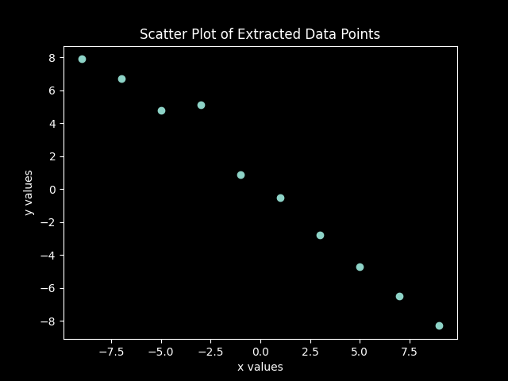

# aimlmid2026_a_dolidze25
Task1_1.Finding the correlation
Find the data at the following address "max.ge/aiml_midterm/51892_html". On the given online graph, the data is displayed
with blue dots. When hovering the mouse over the data, the coordinates of the data point are displayed on the screen.
Find Pearson's correlation coefficient and describe the process in your report. (5 points).
The report must also include a relevant graph for visualization. (5 points).

Given Data On the given online graph,
The dataset consists of 10 paired observations obtained from the online graph (blue dots):

x = [−9, −7, −5, −3, −1, 1, 3, 5, 7, 9]

y = [7.9, 6.7, 4.8, 5.1, 0.9, −0.5, −2.8, −4.7, −6.5, −8.3]

To measure the linear relationship between variables x and y, Pearson’s correlation coefficient (r) was calculated using python code.
The value r = −0.9914 indicates a very strong negative linear correlation between x and y.
This means that as x increases, y decreases almost linearly. The points closely follow a downward-sloping straight line, which confirms the strength of the relationship.
# Pearson Correlation Analysis

This is the correlation analysis of the dataset extracted from the online graph.

2. Spam email detection
